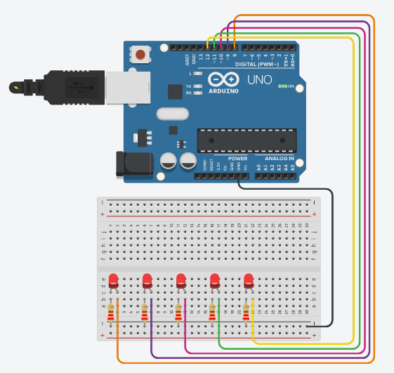

# Contador de Dedos e Controle de LEDs usando Arduino e Computer Vision

Este projeto consiste em um sistema de visão computacional que utiliza uma webcam para contar o número de dedos mostrados pelo usuário e, em seguida, acende uma quantidade correspondente de LEDs conectados a uma placa Arduino.

## Funcionalidades

Contagem de Dedos: Utilizando técnicas de processamento de imagem, o sistema é capaz de identificar e contar o número de dedos mostrados pelo usuário.

### Controle de LEDs: 

Após contar os dedos, o sistema acende uma quantidade correspondente de LEDs conectados ao Arduino, proporcionando uma representação visual do número de dedos contados.

### Interatividade: 

O sistema é interativo e intuitivo, permitindo que o usuário experimente e veja os resultados instantaneamente.

## Componentes Necessários

- Webcam
- Placa Arduino
- LEDs
- Resistores
- Protoboard
- Jumpers

## Instalação e Configuração
Clone o Repositório: Clone este repositório para o seu ambiente local.

```
git clone https://github.com/euclidespaim/Finger-Counting.git
```

### Instale as Dependências: 

Certifique-se de que todas as dependências necessárias estão instaladas. Isso pode incluir bibliotecas de processamento de imagem, como OpenCV, e bibliotecas para comunicação com o Arduino.

### Conecte os Componentes: 

Conecte a webcam ao computador e os LEDs à placa Arduino conforme indicado no esquema de montagem.



### Compile e Carregue o Código Arduino: 

Abra o arquivo .ino no IDE do Arduino e carregue-o na placa.

### Execute o Script Python: 

Execute o script Python responsável pela captura de vídeo, processamento de imagem e controle do Arduino.

```
python new.py
```

### Interaja com o Sistema: 

Mostre seus dedos para a webcam e observe como os LEDs acendem de acordo com o número de dedos detectados.


## Contribuição

Contribuições são bem-vindas! Se você encontrar um problema ou tiver alguma sugestão para melhorar este projeto, sinta-se à vontade para abrir uma issue ou enviar um pull request.

Autores
Este projeto foi desenvolvido por Euclides Paim.

Licença
Este projeto está licenciado sob a Licença MIT - consulte o arquivo LICENSE para mais detalhes.